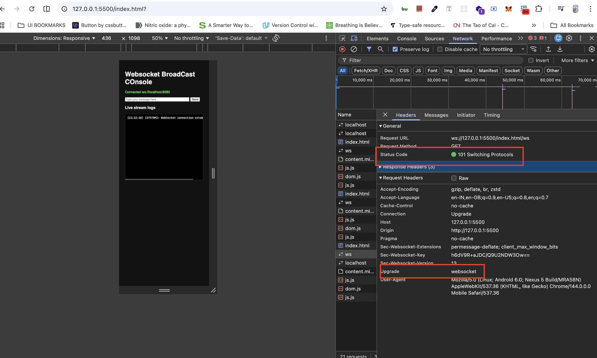

# Websockets practise with ws library

## WebSocket protocol

A WebSocket request looks like an HTTP request with an additional request header `Upgrade: websocket`. If successful, the server responds with `101 Switching Protocols`, and a WebSocket connection is established.

### Only send messages when the WebSocket is in the OPEN state
